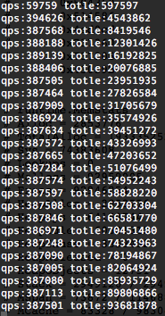
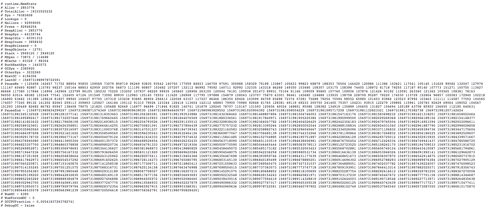
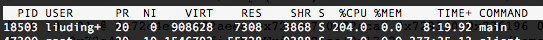
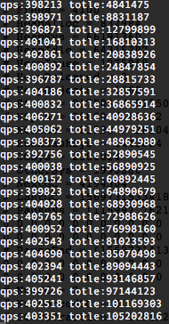
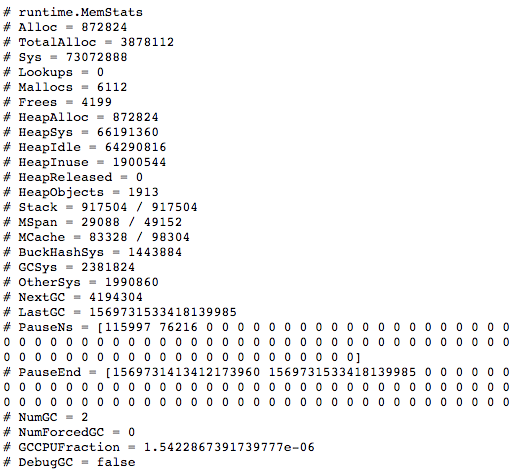

## 测试说明

该测试主要为了对比原生go net包与基于epoll直接通过Syscall系统调用的方法操作FD的性能差异。

两者的区别在于后者绕过了go原生net包的封装的逻辑，以及不会因为连接数的增多而Goroutine数量增多。

## 模块说明

epollServer.go 直接通过epoll_wait分发消息、支持同一个listen的fd注册到多个不同epoll句柄里

goNetServer.go Go原生net包

client.go 压测客户端

## 压测场景1

### 环境

|  参数  |   |
| :---- | :---- |
| CPU型号 | Intel(R) Xeon(R) CPU E5-2670 v3 @ 2.30GHz |
| CPU线程数 | 48 |
| Go版本 | 1.12.6 |
| Socket链接数 | 50 |
| epollServer epoll数量 | 5 |

注：该场景为连接数较少，但QPS大。（场景例如：内网模块之间的RPC通讯、队里系统、存储服务的网关模块等等）

### 压测结果

|  | goNetServer | epollServer |
| :---- | :---- | :---- |
| CPU | 947% | 204% |
| QPS | 40万 | 39万 |

说明：CPU消耗大概相差5倍，QPS大致差不多。epollServer的优化效果还是好很多。

### goNetServer详细压测数据

**CPU Profile**

**CPU Top**

**QPS**

**MemStats**

### epollServer详细压测数据

**CPU Profile**

**CPU Top**

**QPS**

**MemStats**

### cpu profile diff

